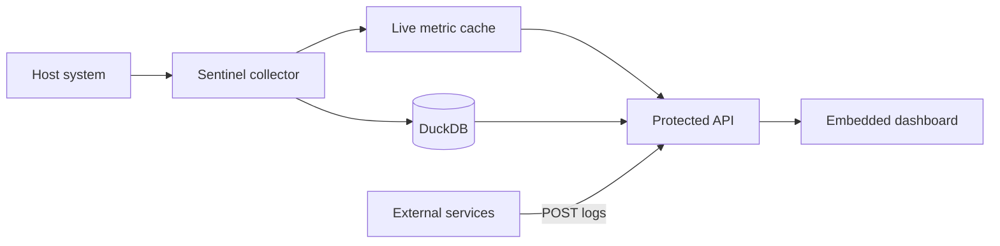

<div align="center">

# 🛰️ Sentinel

### A tiny self-hosted monitor with a surprisingly sharp view.

CPU, memory, disk, load, processes, listening ports and logs — collected by one Go binary, persisted in DuckDB and presented through an embedded responsive dashboard.


**Single binary · Embedded UI · Embedded database · No frontend build step**

</div>

---



> [!IMPORTANT]
> Sentinel is designed for local or internal-network monitoring. Basic Auth remains optional for trusted local use. If the service is reachable over a network, put it behind an HTTPS reverse proxy.

<details open>
<summary><strong>🇹🇷 Türkçe</strong> — Kurulum, güvenlik ve kullanım</summary>

## Sentinel nedir?

Sentinel, sunucu durumunu gereksiz bir platform kurmadan izlemek için hazırlanmış küçük bir sistem monitörüdür.

- CPU, RAM, swap, disk, load average ve uptime takibi
- En çok kaynak kullanan process listesi
- Dinlenen TCP portları
- DuckDB tabanlı metrik ve log geçmişi
- 1 saatlik ve 24 saatlik performans grafikleri
- Mobil uyumlu, kart tabanlı karanlık dashboard
- Dashboard ve API için opsiyonel Basic Auth
- Harici servislere açık log alma endpoint'i
- Tek binary içinde UI ve sabitlenmiş Chart.js
- Graceful shutdown ve otomatik veri temizliği

Metrikler **30 gün**, loglar **7 gün** saklanır.

## Hızlı başlangıç

### Gereksinimler

- Go `1.25.12+`
- Opsiyonel olarak Docker ve Docker Compose

### Lokal çalıştırma

```bash
# Kalite kontrolleri
make check

# Derle
make build

# localhost:8000 üzerinde çalıştır
make run
```

Dashboard:

```text
http://localhost:8000
```

Lokal çalışmada auth açmak istersen:

```bash
AUTH_USER=admin AUTH_PASSWORD='guclu-bir-parola' make run
```

> [!NOTE]
> Uygulama `.env` dosyasını kendisi yüklemez. Docker Compose `.env` dosyasını otomatik okur; doğrudan `make run` kullanırken değişkenleri shell üzerinden vermelisin.

## Docker ile çalıştırma

Compose yapılandırması Sentinel'i dışarı port yayınlamadan `infra_net` ağına bağlar.

```bash
docker network create infra_net
cp .env.example .env

# .env içindeki AUTH_PASSWORD değerini değiştir
make docker-up
```

Alternatif:

```bash
docker compose up -d --build
```

> [!TIP]
> `docker-compose.yml` yalnızca `expose: 8000` kullanır. Yani servis host üzerinde doğrudan yayınlanmaz; aynı `infra_net` ağına bağlı Nginx, Caddy, Traefik veya başka bir reverse proxy üzerinden erişilmesi beklenir.

### Host izleme mountları

Sentinel gerçek host verilerini okuyabilmek için aşağıdaki yolları read-only bağlar:

| Host yolu | Container yolu | Yetki | Amaç |
|---|---|---:|---|
| `/proc` | `/host/proc` | `ro` | Process ve sistem metrikleri |
| `/sys` | `/host/sys` | `ro` | Donanım ve sıcaklık bilgileri |
| `/` | `/host/root` | `ro` | Host disk kullanımı ve OS bilgisi |
| `./data` | `/data` | `rw` | DuckDB kalıcılığı |

Container tüm Linux capability'lerini düşürür, `no-new-privileges` kullanır ve kendi root filesystem'ini read-only çalıştırır.

> macOS üzerinde Docker Desktop bir Linux VM içinde çalışır. Bu nedenle Docker kurulumu fiziksel macOS hostu yerine VM metriklerini gösterebilir.

## Güvenlik modeli

Sentinel'in güvenlik sınırı **local/internal-first** yaklaşımıdır:

- `AUTH_USER` ve `AUTH_PASSWORD` birlikte verilirse dashboard ve `/api/*` korunur.
- Auth değerlerinden biri boşsa Basic Auth devre dışı kalır.
- `/healthz` container probe'ları için auth dışında kalır.
- Basic Auth ağ üzerinden kullanılacaksa önünde mutlaka HTTPS bulunmalıdır.
- API cevaplarında CSP, clickjacking, MIME sniffing ve referrer korumaları bulunur.
- Log payload'ları seviye, kaynak, mesaj uzunluğu ve body boyutu açısından doğrulanır.
- UI, API verilerini çalıştırılabilir HTML olarak değil metin olarak render eder.
- HTTP header/body/write/idle timeoutları aktiftir.
- Chart.js ve fontlar için çalışma anında harici CDN çağrısı yapılmaz.

## Yapılandırma

| Değişken | Varsayılan | Açıklama |
|---|---|---|
| `PORT` | `8000` | HTTP dinleme portu |
| `DB_PATH` | `metrics.db` | DuckDB dosya yolu |
| `AUTH_USER` | boş | Opsiyonel Basic Auth kullanıcı adı |
| `AUTH_PASSWORD` | boş | Opsiyonel Basic Auth parolası |
| `HOST_PROC` | boş | Host `/proc` mount yolu |
| `HOST_SYS` | boş | Host `/sys` mount yolu |
| `HOST_ROOT` | boş | Host root filesystem mount yolu |

## API

| Method | Endpoint | Auth | Açıklama |
|---:|---|:---:|---|
| `GET` | `/healthz` | Hayır | Uygulama ve DuckDB liveness kontrolü |
| `GET` | `/api/metrics/realtime` | Evet* | Güncel sistem metrikleri |
| `GET` | `/api/metrics/history?range=1h` | Evet* | Son 1 saatin ham metrikleri |
| `GET` | `/api/metrics/history?range=24h` | Evet* | 5 dakikalık gruplarla son 24 saat |
| `GET` | `/api/system/details` | Evet* | Process, port, kernel ve reboot bilgisi |
| `GET` | `/api/logs?level=ALL&query=` | Evet* | Filtrelenmiş son 100 log |
| `POST` | `/api/logs` | Evet* | Harici log kaydı |
| `DELETE` | `/api/logs` | Evet* | Tüm logları temizler |

\* Auth yapılandırılmışsa.

<details>
<summary><strong>POST /api/logs örneği</strong></summary>

```bash
curl \
  -u 'admin:guclu-bir-parola' \
  -H 'Content-Type: application/json' \
  -d '{
    "level": "INFO",
    "message": "Backup completed successfully",
    "source": "backup_cron"
  }' \
  http://localhost:8000/api/logs
```

Kurallar:

- `level`: `INFO`, `WARN` veya `ERROR`
- `message`: zorunlu, en fazla 4096 karakter
- `source`: en fazla 64 karakter
- Request body: en fazla 16 KiB

</details>

## Geliştirme komutları

| Komut | İşlev |
|---|---|
| `make check` | Format, vet, lint ve govulncheck |
| `make build` | Lokal binary üretir |
| `make run` | Derleyip `localhost:8000` üzerinde çalıştırır |
| `make clean` | Üretilen binary'yi temizler |
| `make docker-build` | Docker imajını oluşturur |
| `make docker-up` | Compose servisini başlatır |
| `make docker-down` | Compose servisini durdurur |
| `make docker-logs` | Container loglarını takip eder |

## Proje yapısı

```text
sentinel/
├── main.go                 # Collector, API, auth ve DuckDB
├── main_test.go            # Güvenlik/input doğrulama testleri
├── web/
│   ├── index.html          # Embedded dashboard
│   ├── style.css           # Responsive kart sistemi
│   ├── app.js              # Güvenli DOM render ve polling
│   └── vendor/             # Sabitlenmiş Chart.js + lisansı
├── Dockerfile              # Go 1.25.12 multi-stage build
├── docker-compose.yml      # Read-only host monitoring
├── Makefile                # Geliştirme komutları
└── .env.example            # Auth örneği
```

</details>

<details>
<summary><strong>🇬🇧 English</strong> — Setup, security and usage</summary>

## What is Sentinel?

Sentinel is a compact system monitor for keeping an eye on a machine without deploying a large observability platform.

- CPU, memory, swap, disk, load average and uptime metrics
- Top resource-consuming processes
- Listening TCP ports
- DuckDB-backed metric and log history
- One-hour and 24-hour performance charts
- Responsive card-based dark dashboard
- Optional Basic Auth for the dashboard and API
- Log ingestion endpoint for external services
- UI and pinned Chart.js embedded in one binary
- Graceful shutdown and automatic data retention

Metrics are retained for **30 days** and logs for **7 days**.

## Quick start

### Requirements

- Go `1.25.12+`
- Docker and Docker Compose are optional

### Run locally

```bash
# Run formatting, vet, lint and vulnerability checks
make check

# Build the binary
make build

# Run on localhost:8000
make run
```

Dashboard:

```text
http://localhost:8000
```

Enable authentication for a local run:

```bash
AUTH_USER=admin AUTH_PASSWORD='a-strong-password' make run
```

> [!NOTE]
> The application does not load `.env` by itself. Docker Compose reads `.env` automatically; pass variables through your shell when using `make run` directly.

## Run with Docker

The Compose configuration connects Sentinel to `infra_net` without publishing a host port.

```bash
docker network create infra_net
cp .env.example .env

# Replace AUTH_PASSWORD inside .env
make docker-up
```

Alternative:

```bash
docker compose up -d --build
```

> [!TIP]
> `docker-compose.yml` uses only `expose: 8000`. Sentinel is expected to be reached through Nginx, Caddy, Traefik or another reverse proxy attached to the same `infra_net` network.

### Host monitoring mounts

| Host path | Container path | Access | Purpose |
|---|---|---:|---|
| `/proc` | `/host/proc` | `ro` | Processes and system metrics |
| `/sys` | `/host/sys` | `ro` | Hardware and thermal data |
| `/` | `/host/root` | `ro` | Host disk usage and OS information |
| `./data` | `/data` | `rw` | Persistent DuckDB storage |

The container drops every Linux capability, enables `no-new-privileges`, and runs with a read-only root filesystem.

> Docker Desktop on macOS runs inside a Linux VM, so a containerized Sentinel may report VM metrics instead of physical macOS host metrics.

## Security model

Sentinel follows a **local/internal-first** security model:

- When both `AUTH_USER` and `AUTH_PASSWORD` are set, the dashboard and `/api/*` require Basic Auth.
- Authentication remains disabled when either value is empty.
- `/healthz` stays unauthenticated for container probes.
- Network-accessible Basic Auth must always be placed behind HTTPS.
- Responses include CSP, clickjacking, MIME-sniffing and referrer protections.
- Log payloads are validated for level, source, message length and body size.
- API values are rendered as text rather than executable HTML.
- Header, body, write and idle HTTP timeouts are enabled.
- The running dashboard makes no external CDN or font request.

## Configuration

| Variable | Default | Description |
|---|---|---|
| `PORT` | `8000` | HTTP listening port |
| `DB_PATH` | `metrics.db` | DuckDB database path |
| `AUTH_USER` | empty | Optional Basic Auth username |
| `AUTH_PASSWORD` | empty | Optional Basic Auth password |
| `HOST_PROC` | empty | Mounted host `/proc` path |
| `HOST_SYS` | empty | Mounted host `/sys` path |
| `HOST_ROOT` | empty | Mounted host root filesystem path |

## API

| Method | Endpoint | Auth | Description |
|---:|---|:---:|---|
| `GET` | `/healthz` | No | Application and DuckDB liveness |
| `GET` | `/api/metrics/realtime` | Yes* | Current system metrics |
| `GET` | `/api/metrics/history?range=1h` | Yes* | Raw metrics for the last hour |
| `GET` | `/api/metrics/history?range=24h` | Yes* | Last 24 hours in five-minute buckets |
| `GET` | `/api/system/details` | Yes* | Processes, ports, kernel and reboot state |
| `GET` | `/api/logs?level=ALL&query=` | Yes* | Latest 100 filtered logs |
| `POST` | `/api/logs` | Yes* | Ingest an external log |
| `DELETE` | `/api/logs` | Yes* | Clear every stored log |

\* When authentication is configured.

<details>
<summary><strong>POST /api/logs example</strong></summary>

```bash
curl \
  -u 'admin:a-strong-password' \
  -H 'Content-Type: application/json' \
  -d '{
    "level": "INFO",
    "message": "Backup completed successfully",
    "source": "backup_cron"
  }' \
  http://localhost:8000/api/logs
```

Rules:

- `level`: `INFO`, `WARN` or `ERROR`
- `message`: required, up to 4096 characters
- `source`: up to 64 characters
- Request body: up to 16 KiB

</details>

## Development commands

| Command | Purpose |
|---|---|
| `make check` | Format, vet, lint and govulncheck |
| `make build` | Build the local binary |
| `make run` | Build and run on `localhost:8000` |
| `make clean` | Remove the generated binary |
| `make docker-build` | Build the Docker image |
| `make docker-up` | Start the Compose service |
| `make docker-down` | Stop the Compose service |
| `make docker-logs` | Follow container logs |

## Project layout

```text
sentinel/
├── main.go                 # Collector, API, auth and DuckDB
├── main_test.go            # Security and input validation tests
├── web/
│   ├── index.html          # Embedded dashboard
│   ├── style.css           # Responsive card system
│   ├── app.js              # Safe DOM rendering and polling
│   └── vendor/             # Pinned Chart.js and its license
├── Dockerfile              # Go 1.25.12 multi-stage build
├── docker-compose.yml      # Read-only host monitoring
├── Makefile                # Development commands
└── .env.example            # Authentication example
```

</details>

---

<div align="center">

Built for the moment when `htop` is not enough, but a full observability stack is too much.

**Sentinel watches quietly.**

</div>
