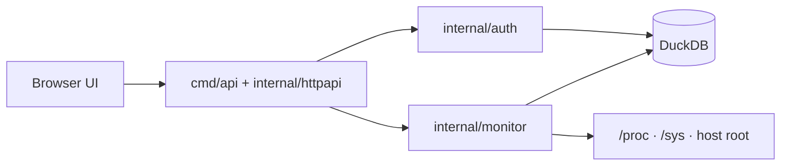

# Sentinel

Kompakt, tek binary olarak dağıtılan host telemetry ve anomaly detection paneli.

- Go + DuckDB
- `cmd/api` ve `internal/*` paket yapısı
- HttpOnly oturum cookie’si, CSRF koruması ve brute-force kilidi
- CPU, bellek, disk, load, network ve disk I/O telemetrisi
- Rolling baseline, z-score anomaly detection ve threshold alert’leri
- Gömülü, responsive web arayüzü

<details open>
<summary><strong>Türkçe</strong></summary>

## Mimari

```text
sentinel/
├── cmd/api/                 # Uygulama entrypoint'i
├── internal/
│   ├── app/                 # Başlatma ve graceful shutdown
│   ├── auth/                # Oturum, parola, CSRF ve login lockout
│   ├── config/              # Ortam değişkeni kontratı
│   ├── httpapi/             # Router, middleware ve HTTP handler'ları
│   ├── monitor/             # Host collector, anomaly ve alert engine
│   └── store/               # DuckDB migration ve sorguları
├── web/                     # Binary içine gömülen UI dosyaları
├── Dockerfile
└── docker-compose.yml
```

İstek akışı:


```mermaid
flowchart LR
    Browser["Browser UI"] --> API["cmd/api + internal/httpapi"]
    API --> Auth["internal/auth"]
    API --> Monitor["internal/monitor"]
    Auth --> DB[("DuckDB")]
    Monitor --> DB
    Monitor --> Host["/proc · /sys · host root"]
```

## İlk çalıştırma

Gereksinimler:

- Go `1.25.12`
- CGO destekli toolchain
- İlk admin için en az 12 karakterlik parola

```bash
cp .env.example .env
# .env içindeki ADMIN_PASSWORD değerini değiştir
make run
```

Panel: `http://localhost:8000`

İlk açılışta `users` tablosu boşsa `ADMIN_EMAIL`, `ADMIN_NAME` ve
`ADMIN_PASSWORD` ile admin oluşturulur. `ADMIN_PASSWORD` sonraki başlangıçlarda
mevcut hesabın parolasını otomatik değiştirmez; parola paneldeki hesap
menüsünden değiştirilir.

> Eski kurulumların geçişi için `AUTH_USER` ve `AUTH_PASSWORD`, yeni admin
> değişkenleri verilmediğinde fallback olarak okunur.

## Auth modeli

- Tarayıcı yalnızca rastgele, opaque bir `sentinel_session` cookie’si alır.
- Cookie `HttpOnly` ve `SameSite=Strict` olarak ayarlanır.
- Sunucuda session token’ın kendisi değil SHA-256 özeti tutulur.
- Yazma istekleri session’a bağlı `X-CSRF-Token` ister.
- Beş hatalı girişten sonra login + IP çifti 15 dakika kilitlenir.
- Parola bcrypt ile hashlenir.
- Parola değişimi kullanıcının tüm aktif oturumlarını kapatır.
- `/healthz` public; dashboard ve `/api/*` auth korumalıdır.

`AUTH_COOKIE_SECURE=true` yalnızca servis gerçekten HTTPS üzerinden
yayınlanıyorsa kullanılmalıdır. Sentinel’i ağ üzerinden HTTP ile açmayın; HTTPS
reverse proxy arkasında tutun.

## Ortam değişkenleri

| Değişken | Varsayılan | Açıklama |
|---|---:|---|
| `PORT` | `8000` | HTTP portu |
| `DB_PATH` | `metrics.db` | DuckDB dosyası |
| `ADMIN_EMAIL` | `admin@sentinel.local` | İlk admin login değeri |
| `ADMIN_NAME` | `Sentinel Admin` | İlk admin görünen adı |
| `ADMIN_PASSWORD` | yok | İlk açılışta zorunlu, min. 12 karakter |
| `AUTH_COOKIE_SECURE` | `false` | HTTPS ortamında `true` |
| `AUTH_SESSION_TTL` | `12h` | `15m`–`720h` arası oturum süresi |
| `TRUST_PROXY_HEADERS` | `false` | Yalnız güvenilir proxy arkasında `true` |
| `HOST_ROOT` | boş | Host root mount yolu |
| `HOST_SYS` | boş | Host sysfs mount yolu |

Uygulama başlangıçta çalışma dizinindeki `.env` dosyasını yükler; gerçek ortam
değişkenleri `.env` değerlerinden önceliklidir. `.env` Git tarafından yok
sayılır.

## API

| Method | Route | Auth | Açıklama |
|---|---|---|---|
| `GET` | `/healthz` | Hayır | DB liveness |
| `POST` | `/api/auth/login` | Hayır | Oturum aç |
| `GET` | `/api/auth/me` | Evet | Kullanıcı + CSRF token |
| `POST` | `/api/auth/logout` | Evet + CSRF | Oturumu kapat |
| `POST` | `/api/auth/password` | Evet + CSRF | Parola değiştir |
| `GET` | `/api/metrics/realtime` | Evet | Son host snapshot |
| `GET` | `/api/metrics/history?range=1h` | Evet | `1h`, `6h`, `24h`, `7d` |
| `GET` | `/api/metrics/summary` | Evet | Rolling baseline |
| `GET` | `/api/anomalies` | Evet | Anomaly geçmişi |
| `GET` | `/api/alerts/rules` | Evet | Aktif threshold kuralları |
| `GET` | `/api/alerts/events` | Evet | Alert geçmişi |
| `GET/POST/DELETE` | `/api/logs` | Evet | Event akışı |
| `GET` | `/api/system/details` | Evet | Process, port, kernel |
| `GET` | `/api/export/*.csv` | Evet | CSV export |

Cookie ve CSRF ile örnek:

```bash
curl -c /tmp/sentinel.cookies \
  -H 'Content-Type: application/json' \
  -d '{"email":"admin@sentinel.local","password":"YOUR_LONG_PASSWORD"}' \
  http://localhost:8000/api/auth/login
```

Login response içindeki `csrf_token`, `POST`/`DELETE` isteklerinde
`X-CSRF-Token` header’ı olarak gönderilir. Parolayı shell history’ye yazmamak
için gerçek kullanımda güvenli bir secret yöntemi tercih edin.

## Docker Compose

```bash
cp .env.example .env
# Güçlü admin parolası ayarla
docker compose build
docker compose up -d
```

Compose kontratı:

- Host port yayınlamaz; yalnız external `infra_net` üzerinde `8000` expose eder.
- `pid: host`, read-only `/proc`, `/sys` ve host root mountları kullanır.
- Root filesystem read-only, capability’ler drop, `no-new-privileges` açıktır.
- `/data` kalıcı ve yazılabilirdir.

Önce ağı oluşturun:

```bash
docker network create infra_net
```

Reverse proxy aynı network’ten `sentinel:8000` hedefine bağlanmalıdır.

## Kalite kontrolleri

```bash
make test
make vet
make build
docker compose config --quiet
```

`make vulncheck` güncel vulnerability verisi için ağ erişimi ister.

## Veri ve retention

- Metrics: 30 gün
- Anomalies: 30 gün
- Alert events: 30 gün
- System events/logs: 7 gün
- Süresi biten sessions: saatlik temizlenir

`data/`, `metrics.db`, DuckDB WAL dosyaları, `.env` ve binary çıktıları Git’e
alınmaz.

</details>

<details>
<summary><strong>English</strong></summary>

## Overview

Sentinel is a compact, single-binary host telemetry console backed by DuckDB.
It collects CPU, memory, disk, load, network, and disk I/O metrics; builds a
rolling statistical baseline; detects z-score anomalies; and evaluates
threshold alert rules.

The Go code is split into:

- `cmd/api`: executable entrypoint
- `internal/app`: lifecycle and graceful shutdown
- `internal/auth`: sessions, password hashing, CSRF, and login lockout
- `internal/config`: environment contract
- `internal/httpapi`: router, middleware, and handlers
- `internal/monitor`: collection, anomaly detection, and alert evaluation
- `internal/store`: DuckDB schema and queries
- `web`: embedded responsive UI

## First run

```bash
cp .env.example .env
# Replace ADMIN_PASSWORD with a value of at least 12 characters.
make run
```

Open `http://localhost:8000`.

When the users table is empty, Sentinel creates the first administrator from
`ADMIN_EMAIL`, `ADMIN_NAME`, and `ADMIN_PASSWORD`. The bootstrap password does
not rotate an existing account on restart. Change it from the account menu.

Legacy `AUTH_USER` and `AUTH_PASSWORD` values remain accepted as bootstrap
fallbacks when the new variables are absent.

## Authentication and security

- Opaque server-side sessions; only the token hash is persisted
- HttpOnly, SameSite=Strict session cookie
- Session-bound CSRF token for state-changing requests
- bcrypt password hashing
- 15-minute lockout after five failed attempts per login and client IP
- Password changes revoke all sessions
- Public `/healthz`; authenticated dashboard and API

Set `AUTH_COOKIE_SECURE=true` only when the browser reaches Sentinel over
HTTPS. Keep network deployments behind an HTTPS reverse proxy.

## Docker

```bash
docker network create infra_net
cp .env.example .env
docker compose build
docker compose up -d
```

Compose exposes port `8000` only on the external `infra_net`; it does not
publish a host port. The container uses a read-only root filesystem, dropped
capabilities, no-new-privileges, and read-only host inspection mounts.

## Validation

```bash
make test
make vet
make build
docker compose config --quiet
```

Metrics, anomalies, and alerts are retained for 30 days; system events for 7
days. Database files, `.env`, WAL files, and binaries are ignored by Git.

</details>
