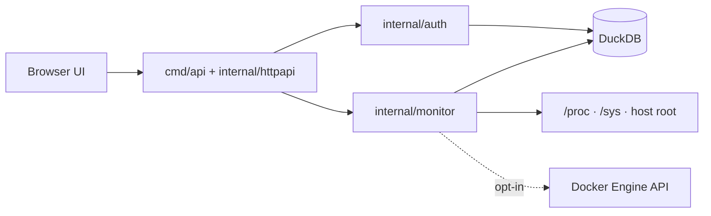

# Sentinel

Kompakt, tek binary olarak dağıtılan host telemetry ve anomaly detection paneli.

- Go + DuckDB
- `cmd/api` ve `internal/*` paket yapısı
- HttpOnly oturum cookie’si, CSRF koruması ve brute-force kilidi
- CPU, bellek, swap, disk, load, network ve disk I/O telemetrisi
- Bağlı diskler için ayrı kapasite, kullanım ve kullanılabilir alan görünümü
- Opsiyonel container bazlı CPU, working-set RAM, network ve PID telemetrisi
- Rolling baseline, z-score anomaly detection ve threshold alert’leri
- Gömülü, responsive web arayüzü

<details open>
<summary><strong>Türkçe</strong></summary>

## Mimari

```text
sentinel/
├── cmd/api/                 # Uygulama entrypoint'i
├── internal/
│   ├── app/                 # Başlatma ve graceful shutdown
│   ├── auth/                # Oturum, parola, CSRF ve login lockout
│   ├── config/              # Ortam değişkeni kontratı
│   ├── httpapi/             # Router, middleware ve HTTP handler'ları
│   ├── monitor/             # Host collector, anomaly ve alert engine
│   └── store/               # DuckDB migration ve sorguları
├── web/                     # Binary içine gömülen UI dosyaları
├── Dockerfile
└── docker-compose.yml
```

İstek akışı:


```mermaid
flowchart LR
    Browser["Browser UI"] --> API["cmd/api + internal/httpapi"]
    API --> Auth["internal/auth"]
    API --> Monitor["internal/monitor"]
    Auth --> DB[("DuckDB")]
    Monitor --> DB
    Monitor --> Host["/proc · /sys · host root"]
    Monitor -. opt-in .-> Docker["Docker Engine API"]
```

## İlk çalıştırma

Gereksinimler:

- Go `1.25.12`
- CGO destekli toolchain
- İlk admin için en az 8 karakterlik parola

```bash
cp .env.example .env
# .env içindeki ADMIN_PASSWORD değerini değiştir
make run
```

Panel: `http://localhost:8000`

İlk açılışta `ADMIN_LOGIN`, `ADMIN_NAME` ve `ADMIN_PASSWORD` ile admin
oluşturulur. Sonraki başlangıçlarda bu değerler mevcut admin hesapla
senkronlanır; böylece `.env` üzerinden kullanıcı adı/parola kurtarma ve reset
yapılabilir. `ADMIN_PASSWORD` ortamda kalırsa panelden yapılan parola değişikliği
sonraki restartta tekrar `.env` değerine döner.

> Eski kurulumların geçişi için `ADMIN_EMAIL`, `AUTH_USER` ve `AUTH_PASSWORD`,
> yeni admin değişkenleri verilmediğinde fallback olarak okunur.

## Auth modeli

- Tarayıcı yalnızca rastgele, opaque bir `sentinel_session` cookie’si alır.
- Cookie `HttpOnly` ve `SameSite=Strict` olarak ayarlanır.
- Sunucuda session token’ın kendisi değil SHA-256 özeti tutulur.
- Yazma istekleri session’a bağlı `X-CSRF-Token` ister.
- Aynı IP'den beş hatalı girişten sonra, kullanıcı adından bağımsız olarak
  15 dakika kilit uygulanır. Kilit restart sonrası da korunur; süresi dolunca
  veya başarılı girişte hata sayacı sıfırlanır.
- Aynı anda bir giriş işlemi yürütülür; diğer girişler kuyrukta bekletilmeden
  `429` alır. Tüm IP'ler için toplam parola kontrol bütçesi ilk anda 10 denemedir,
  her 3 saniyede bir deneme yenilenir (sürekli trafikte dakikada 20).
  Bu kısa süreli toplam bütçe restart ile sıfırlanır.
- Limit yanıtları `Retry-After` başlığında bekleme süresini saniye olarak verir.
  Süresi dolmuş ve bir günden eski giriş denemeleri saatlik temizlenir.
- Parola bcrypt ile hashlenir.
- Parola uzunluğu 8 karakter ile bcrypt sınırı olan 72 byte arasındadır.
- Parola değişimi kullanıcının tüm aktif oturumlarını kapatır.
- `/healthz` public; dashboard ve `/api/*` auth korumalıdır.

`AUTH_COOKIE_SECURE=true` yalnızca servis gerçekten HTTPS üzerinden
yayınlanıyorsa kullanılmalıdır. Sentinel’i ağ üzerinden HTTP ile açmayın; HTTPS
reverse proxy arkasında tutun.

## Ortam değişkenleri

| Değişken | Varsayılan | Açıklama |
|---|---:|---|
| `PORT` | `8000` | HTTP portu |
| `DB_PATH` | `metrics.db` | DuckDB dosyası |
| `ADMIN_LOGIN` | `admin` | Admin kullanıcı adı |
| `ADMIN_NAME` | `Sentinel Admin` | Admin görünen adı |
| `ADMIN_PASSWORD` | yok | Admin parolası/reset değeri, min. 8 karakter |
| `AUTH_COOKIE_SECURE` | `false` | HTTPS ortamında `true` |
| `AUTH_SESSION_TTL` | `12h` | `15m`–`720h` arası oturum süresi |
| `AUTH_ALLOWED_ORIGINS` | boş | Virgülle ayrılmış public origin listesi |
| `TRUST_PROXY_HEADERS` | `false` | Yalnız güvenilir proxy arkasında `true` |
| `HOST_ROOT` | boş | Host root mount yolu |
| `HOST_SYS` | boş | Host sysfs mount yolu |
| `NETWORK_INTERFACES` | boş | Sayaçlara dahil edilecek virgülle ayrılmış arayüzler |
| `CONTAINER_METRICS_ENABLED` | `false` | Docker container telemetrisini açar |
| `CONTAINER_COLLECTION_INTERVAL` | `30s` | İlk container ölçüm aralığı: `15s`, `30s`, `45s`, `1m`, `2m` |
| `CONTAINER_API_URL` | boş | Korunan Docker API/proxy adresi |
| `DOCKER_SOCKET` | `/var/run/docker.sock` | API URL yoksa kullanılan Unix socket |
| `SYSTEMD_UNITS` | boş | Durumu ve journal özeti okunacak virgülle ayrılmış `.service` allowlist'i |
| `SYSTEMD_LOG_LINES` | `8` | Servis başına gösterilecek son journal satırı (`1`–`50`) |

Uygulama başlangıçta çalışma dizinindeki `.env` dosyasını yükler; gerçek ortam
değişkenleri `.env` değerlerinden önceliklidir. `.env` Git tarafından yok
sayılır.

HTTPS reverse proxy `Host` header’ını koruyorsa ayrıca bir ayar gerekmez. Proxy
upstream’e `Host: sentinel:8000` gibi farklı bir değer gönderiyorsa public adresi
açıkça tanımlayın:

```env
AUTH_COOKIE_SECURE=true
AUTH_ALLOWED_ORIGINS=https://sentinel.example.com
```

`TRUST_PROXY_HEADERS=true` alternatifi yalnız Sentinel’e doğrudan internetten
erişilemiyor ve tüm istekler güvenilir proxy’den geliyorsa kullanılmalıdır.

Doğrudan Nginx Proxy Manager arkasında çalıştırırken `TRUST_PROXY_HEADERS=true`
ayarlayın; aksi halde bütün ziyaretçiler NPM'nin IP'sini paylaşır ve bir
saldırganın kilidi sizin girişinizi de engelleyebilir. Standart NPM
`X-Forwarded-For` sonuna bağlanan istemcinin IP'sini ekler. Sentinel yalnızca
bu son adresi kullanır; istemcinin eklediği önceki adreslere güvenmez. NPM'nin
önünde Cloudflare/CDN veya başka proxy varsa bu adres o proxy'ye ait olabilir;
önce gerçek istemci IP'sinin NPM'de güvenilir biçimde çözüldüğünü doğrulayın.
Özel NPM ayarları bu başlığı değiştirebilir. Compose host portu yayınlamaz;
aynı Docker ağından doğrudan erişen istemciler de bu güven sınırının içindedir.

`AUTH_COOKIE_SECURE` yalnız cookie güvenliğini yönetir; origin doğrulamasının
şemasını değiştirmez.

## API

| Method | Route | Auth | Açıklama |
|---|---|---|---|
| `GET` | `/healthz` | Hayır | DB + telemetry freshness |
| `POST` | `/api/auth/login` | Hayır | Oturum aç |
| `GET` | `/api/auth/me` | Evet | Kullanıcı + CSRF token |
| `POST` | `/api/auth/logout` | Evet + CSRF | Oturumu kapat |
| `POST` | `/api/auth/password` | Evet + CSRF | Parola değiştir |
| `GET` | `/api/metrics/realtime` | Evet | Son host snapshot |
| `GET` | `/api/metrics/history?range=1h` | Evet | `1h`, `6h`, `24h`, `7d` |
| `GET` | `/api/metrics/summary` | Evet | Rolling baseline |
| `GET` | `/api/anomalies` | Evet | Anomaly geçmişi |
| `GET` | `/api/alerts/rules` | Evet | Aktif threshold kuralları |
| `GET` | `/api/alerts/events` | Evet | Alert geçmişi |
| `GET/POST/DELETE` | `/api/logs` | Evet | Event akışı |
| `GET` | `/api/system/details` | Evet | Process, port, kernel |
| `GET` | `/api/system/services` | Evet | Allowlist'teki systemd servislerinin cache'li status bilgisi |
| `GET` | `/api/system/services/{unit}/logs` | Evet | Allowlist'teki tek servis için on-demand journal özeti |
| `GET` | `/api/containers` | Evet | Opsiyonel container snapshot'ı |
| `PUT` | `/api/containers/settings` | Evet + CSRF | Container ölçüm aralığını değiştirir |
| `GET` | `/api/export/*.csv` | Evet | CSV export |

Network kartı anlık inbound/outbound hızını ve host açılışından beri biriken
inbound, outbound ve toplam byte sayaçlarını gösterir. Bu host seviyesinde tüm
ağ arayüzlerinin toplamıdır; bridge, veth ve loopback trafiğini içerebileceği
için internet sağlayıcısı fatura ölçümü olarak değerlendirilmemelidir.
`NETWORK_INTERFACES=eth0,wlan0` gibi açık bir liste verilerek hangi sayaçların
dahil olacağı sınırlandırılabilir.

## Systemd servis gözetimi

Panel yalnız açıkça seçilen `.service` unit'lerini salt-okunur olarak sorgular;
start, stop veya restart endpoint'i sunmaz. Örneğin:

```env
SYSTEMD_UNITS=fail2ban.service,ssh.service,docker.service
SYSTEMD_LOG_LINES=8
```

Services bölümü active/failed durumu, enable durumu, `Restart=` politikası ve
mevcut systemd manager oturumundaki restart sayısını gösterir. Status sorgusu
60 saniye cache'lenir. Son journal kayıtları yalnız servis kartındaki alan
açıldığında ayrı endpoint'ten okunur. Doğrudan hostta çalıştırıldığında
`systemctl` ve `journalctl` PATH'te olmalıdır. Docker image bu araçları içerir;
Compose kurulumu mevcut read-only host root mount'u üzerinden host system bus
ve journal'ını okur. Erişim yoksa
API boş/yanıltıcı durum üretmek yerine özelliği `unavailable` olarak işaretler.

## Container telemetrisi

Container görünümü aynı dashboard içinde ayrı bir bölümdür ve varsayılan olarak
kapalıdır. En güvenli tercih, sadece gerekli read-only route'ları açan,
kimlik doğrulamalı ve ağ ile sınırlandırılmış bir Docker API proxy'sidir:

```env
CONTAINER_METRICS_ENABLED=true
CONTAINER_API_URL=http://docker-metrics-proxy:2375
```

Doğrudan `/var/run/docker.sock` bağlantısı da desteklenir. Mevcut Compose dosyası
socket'i bağlar; bu erişim host üzerinde yüksek yetki verir. Kısıtlı HTTP proxy'ye
geçerseniz socket mount'unu kaldırın. Ayrı bir override dosyası gerekmez.
Kurulum ve ölçüm anlamları için [container metrics rehberine](docs/container-metrics.md) bakın.

Header'daki interval seçici `15s`, `30s`, `45s`, `1m` ve `2m` seçeneklerini
gerçek collector timer'ına uygular. Seçim DuckDB'ye kaydedilir ve restart sonrası
korunur; `.env` değeri yalnız henüz kayıtlı bir UI seçimi yokken başlangıç
varsayılanıdır.

Cookie ve CSRF ile örnek:

```bash
curl -c /tmp/sentinel.cookies \
  -H 'Content-Type: application/json' \
  -d '{"login":"admin","password":"YOUR_LONG_PASSWORD"}' \
  http://localhost:8000/api/auth/login
```

Login response içindeki `csrf_token`, `POST`/`DELETE` isteklerinde
`X-CSRF-Token` header’ı olarak gönderilir. Parolayı shell history’ye yazmamak
için gerçek kullanımda güvenli bir secret yöntemi tercih edin.

## Docker Compose

```bash
cp .env.example .env
# Güçlü admin parolası ayarla
docker compose build
docker compose up -d
```

Compose kontratı:

- Host port yayınlamaz; yalnız external `infra_net` üzerinde `8000` expose eder.
- `pid: host`, read-only `/proc`, `/sys` ve host root mountları kullanır.
- Root filesystem read-only, capability’ler drop, `no-new-privileges` açıktır.
- `/data` kalıcı ve yazılabilirdir.

Overview içindeki **Storage**, `/` ve `/mnt/block` gibi bağlı diskleri 30 saniyede bir
ayrı kartlarda gösterir. Ana disk **System disk**, `/mnt/block` **Block storage**
olarak adlandırılır; kullanım, toplam kapasite ve kullanılabilir alan öne çıkar.
`/boot`, `/boot/efi` ve `/efi` bölümleri açılır **System partitions** detayındadır. Linux'ta `HOST_PROC/1/mountinfo` üzerinden
diskler keşfedilir; kapasiteleri `HOST_ROOT` altındaki karşılıklarından okunur.
`tmpfs`, sanal dosya sistemleri, container overlay'leri ve loop diskleri listelenmez.
Okunamayan veya Docker içinden doğru cihaza ulaşılmayan disk `Unavailable` görünür.
Disk sunucuda bağlıyken konteyneri oluşturun; sonradan eklenen mount görünmüyorsa
`docker compose up -d --force-recreate sentinel` ile yeniden oluşturun.

**Root disk /** kartı, geçmiş grafikler ve mevcut disk alarm kuralları `/` diskine
aittir. Ek diskler canlı listede gösterilir; disk bazlı geçmiş ve alarm kuralı
henüz tutulmaz. Canlı genel sağlık göstergesi ek disklerin doluluğunu da dikkate alır.

Önce ağı oluşturun:

```bash
docker network create infra_net
```

Reverse proxy aynı network’ten `sentinel:8000` hedefine bağlanmalıdır.

## Kalite kontrolleri

```bash
make test
make vet
make build
docker compose config --quiet
```

CI her push/PR için format, race detector, coverage, vet, Go build ve Docker
image build kontrollerini çalıştırır. Gerçek Linux host ve Docker karşılaştırma
adımları [Linux validation checklist](docs/linux-validation.md) içinde yer alır.

`make vulncheck` güncel vulnerability verisi için ağ erişimi ister.

## Veri ve retention

- Metrics: 30 gün
- Anomalies: 30 gün
- Alert events: 30 gün
- System events/logs: 7 gün
- Süresi biten sessions: saatlik temizlenir

`data/`, `metrics.db`, DuckDB WAL dosyaları, `.env` ve binary çıktıları Git’e
alınmaz.

</details>

<details>
<summary><strong>English</strong></summary>

## Overview

Sentinel is a compact, single-binary host telemetry console backed by DuckDB.
It collects CPU, memory, swap, disk, load, network, and disk I/O metrics; builds a
rolling statistical baseline; detects z-score anomalies; and evaluates
threshold alert rules. Optional Docker Engine telemetry adds per-container CPU,
memory working set, cumulative network counters, and PID counts.

The Go code is split into:

- `cmd/api`: executable entrypoint
- `internal/app`: lifecycle and graceful shutdown
- `internal/auth`: sessions, password hashing, CSRF, and login lockout
- `internal/config`: environment contract
- `internal/httpapi`: router, middleware, and handlers
- `internal/monitor`: collection, anomaly detection, and alert evaluation
- `internal/store`: DuckDB schema and queries
- `web`: embedded responsive UI

## First run

```bash
cp .env.example .env
# Replace ADMIN_PASSWORD with a value of at least 8 characters.
make run
```

Open `http://localhost:8000`.

Sentinel creates and synchronizes the administrator from `ADMIN_LOGIN`,
`ADMIN_NAME`, and `ADMIN_PASSWORD`. This makes the environment values the
recovery/reset mechanism for an existing database. If `ADMIN_PASSWORD` remains
configured, a password changed from the account menu will return to the
environment value after restart.

Legacy `ADMIN_EMAIL`, `AUTH_USER`, and `AUTH_PASSWORD` values remain accepted
as fallbacks when the new variables are absent.

## Authentication and security

- Opaque server-side sessions; only the token hash is persisted
- HttpOnly, SameSite=Strict session cookie
- Session-bound CSRF token for state-changing requests
- bcrypt password hashing
- Persistent 15-minute lockout after five failed attempts per client IP,
  across all usernames; expired counters and successful sign-ins start fresh
- One in-flight login; excess concurrent requests receive `429` immediately
- Global password-check budget: burst of 10, refilling once every 3 seconds
  (20/minute sustained); this short-term budget resets on restart
- `Retry-After` on rate limits; hourly cleanup of expired attempts older than a day
- Password changes revoke all sessions
- Public `/healthz`; authenticated dashboard and API

Set `AUTH_COOKIE_SECURE=true` only when the browser reaches Sentinel over
HTTPS. Keep network deployments behind an HTTPS reverse proxy.

For a single trusted Nginx Proxy Manager hop, set `TRUST_PROXY_HEADERS=true`.
Otherwise all visitors share the proxy IP and its lockout. Sentinel reads the
rightmost `X-Forwarded-For` address appended by standard NPM, ignoring spoofable
prefixes. Only enable this when direct access is restricted to trusted callers.
With an additional CDN/proxy before NPM, verify trusted real-IP handling there
first; otherwise the CDN/proxy address is rate-limited instead of the visitor.

When the proxy rewrites the upstream Host header, set the public browser origin
explicitly:

```env
AUTH_COOKIE_SECURE=true
AUTH_ALLOWED_ORIGINS=https://sentinel.example.com
```

## Docker

```bash
docker network create infra_net
cp .env.example .env
docker compose build
docker compose up -d
```

Compose exposes port `8000` only on the external `infra_net`; it does not
publish a host port. The container uses a read-only root filesystem, dropped
capabilities, no-new-privileges, and read-only host inspection mounts.

Container telemetry is disabled by default in configuration, but the current
Compose file mounts `docker.sock`. Direct socket access grants highly privileged
daemon access, including when mounted read-only. If using a restricted HTTP
proxy instead, remove the socket mount. No separate override file is included.
See [container metrics](docs/container-metrics.md).

The header interval selector changes the actual Docker collection timer and
persists the selected `15s`, `30s`, `45s`, `1m`, or `2m` value in DuckDB.

## Validation

```bash
make test
make vet
make build
docker compose config --quiet
```

CI also runs the race detector and builds the Docker image. Use the
[Linux validation checklist](docs/linux-validation.md) for real host and cgroup
verification.

Metrics, anomalies, and alerts are retained for 30 days; system events for 7
days. Database files, `.env`, WAL files, and binaries are ignored by Git.

Optional systemd monitoring is configured with a comma-separated allowlist:

```env
SYSTEMD_UNITS=fail2ban.service,ssh.service,docker.service
SYSTEMD_LOG_LINES=8
```

The Services section reports active/failed state, enablement, the configured
restart policy, and restart count from a 60-second status cache. A bounded
recent journal excerpt is loaded on demand for one allowlisted unit. It is
read-only and exposes no service-control endpoint.

The network card shows live inbound/outbound throughput and the inbound,
outbound, and combined byte counters accumulated since the host booted. These
are host-wide interface counters and can include bridge, veth, and loopback
traffic, so they should not be treated as ISP billing measurements.

</details>

## License

Sentinel is available under the [MIT License](LICENSE).

## Telemetry correctness

- Docker inventory includes stopped containers. Stopped/paused/restarting items
  remain visible without stats requests. A failed stats request marks only that
  container unavailable; totals are withheld when incomplete. CPU is unavailable
  until two valid samples exist. Metadata remains visible beyond the 64-running-
  container stats budget. Removed containers are not a persistent expected-service
  inventory; intentionally stopped jobs can also appear as not running.
- Host and Docker collection run independently. Host data older than 90 seconds
  is stale; `/healthz` returns 503 before the first sample, on stale collection or
  on failed metric persistence. Partial optional sensors do not fail healthchecks.
- Valid fields in partial samples are retained. Missing fields are SQL NULL,
  excluded from statistical baselines, and shown as gaps in charts. Other valid
  metrics continue to trigger alerts. Persistence failures are logged; writing an
  alert to a full/unavailable database cannot be guaranteed.
- With `HOST_PROC` set to a host proc mount, counters and TCP listeners explicitly
  use the host PID 1 network namespace. They never silently fall back to the
  container namespace. Without it, native OS readers are used. Unreadable socket
  ownership is shown as unknown. System details share a 60-second cache.
- `NETWORK_INTERFACES` remains an explicit selector. Empty means the sum of all
  interfaces, including bridges/veth/loopback, not ISP traffic. A missing selected
  interface marks the measurement unavailable.

See [Linux validation](docs/linux-validation.md) for deployment comparisons.
